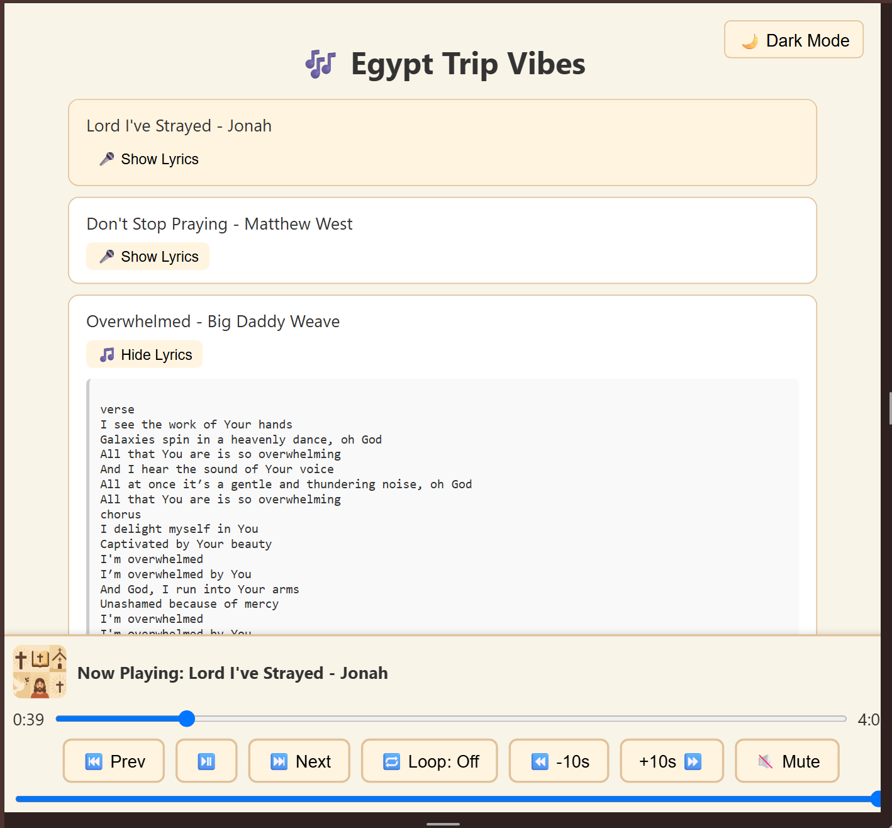

# 🎶 Egypt Trip 2025 Playlist

This is a lightweight, mobile-friendly audio player web app to enjoy hand-picked Christian music curated for a spiritual journey to Egypt in 2025. It’s a personal, offline-capable web playlist with lyrics support, custom styling, and clean UX for both desktop and mobile users.



---

## ✨ Features

- 🎧 Interactive playlist with click-to-play songs
- 🖼️ Custom album art per song
- 📜 Expandable lyrics with "Show Lyrics" toggle
- 🎛️ Playback controls (Play/Pause, Next, Prev, Rewind, Fast-Forward)
- 🔁 Loop toggle and volume/mute controls
- 🌙 Dark mode toggle
- 📱 Mobile-optimized sticky player UI
- ⛺ Works offline after initial load (GitHub Pages static hosting)

---

## 📂 Project Structure

egypt-trip-2025-playlist/
├── index.html
├── style.css
├── script/
│ ├── playlist.js
│ ├── player.js
│ └── theme.js
├── cover/
│ └── standardCover1.png
├── egypt-trip-playlist/
│ └── *.mp3
└── README.md

yaml
Copy
Edit

---

## 🛠️ Run Locally

> You don’t need a framework or backend. It's a static project!

1. **Clone or download** the repository:
   ```bash
   git clone https://github.com/bdelacru/egypt-trip-2025-playlist.git
   cd egypt-trip-2025-playlist
Open index.html in a browser, or run a local server:

With Python 3 installed:

python -m http.server
Then visit http://localhost:8000 in your browser.

🔧 Customize
To add a song: Edit script/playlist.js and add an object to the playlist array:

{
title: "Song Title",
file: "egypt-trip-playlist/song.mp3",
cover: "cover/standardCover1.png",
lyrics: `Optional multiline lyrics...`
}


🌍 Live Demo
Hosted via GitHub Pages:
🔗 https://bdelacru.github.io/egypt-trip-2025-playlist/

🙌 Credits
Built with ❤️ by Betsy De La Cruz for spiritual reflection and joyful worship during her 2025 trip to Egypt.

📜 License
This project is free for personal use. For reuse or distribution of music files, please ensure you have proper rights or permissions.


